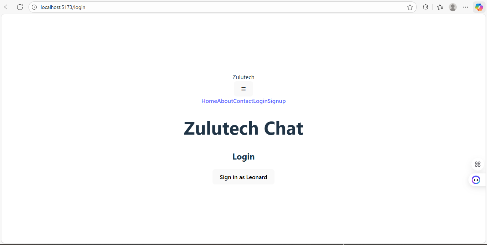
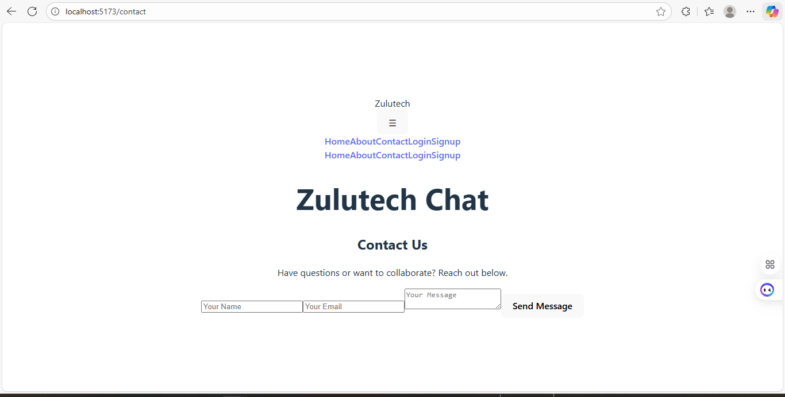
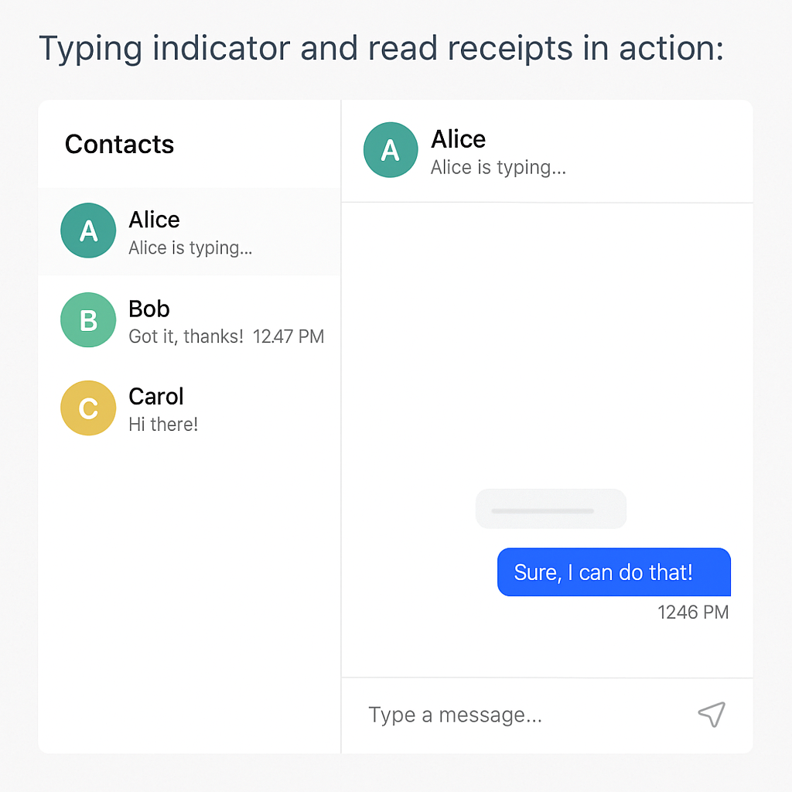
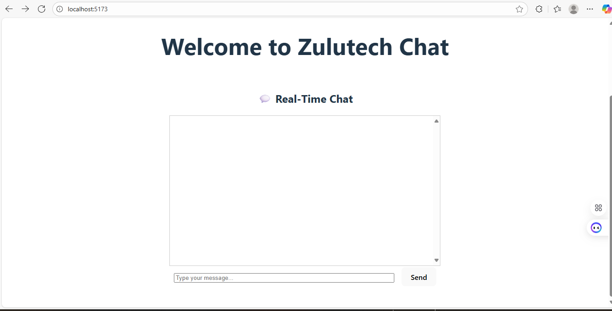
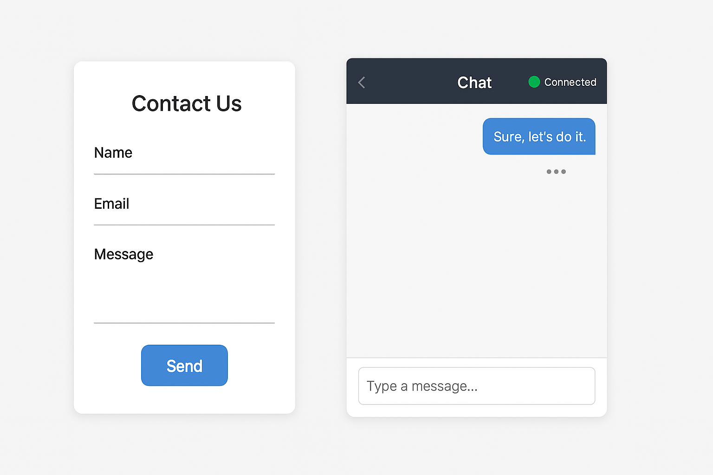
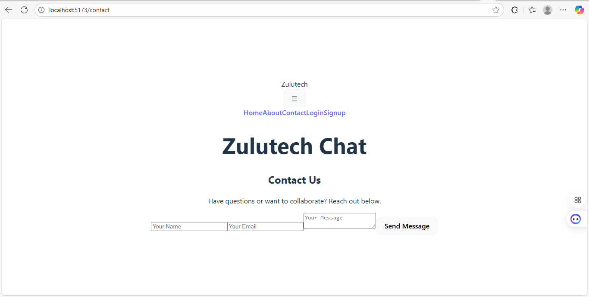
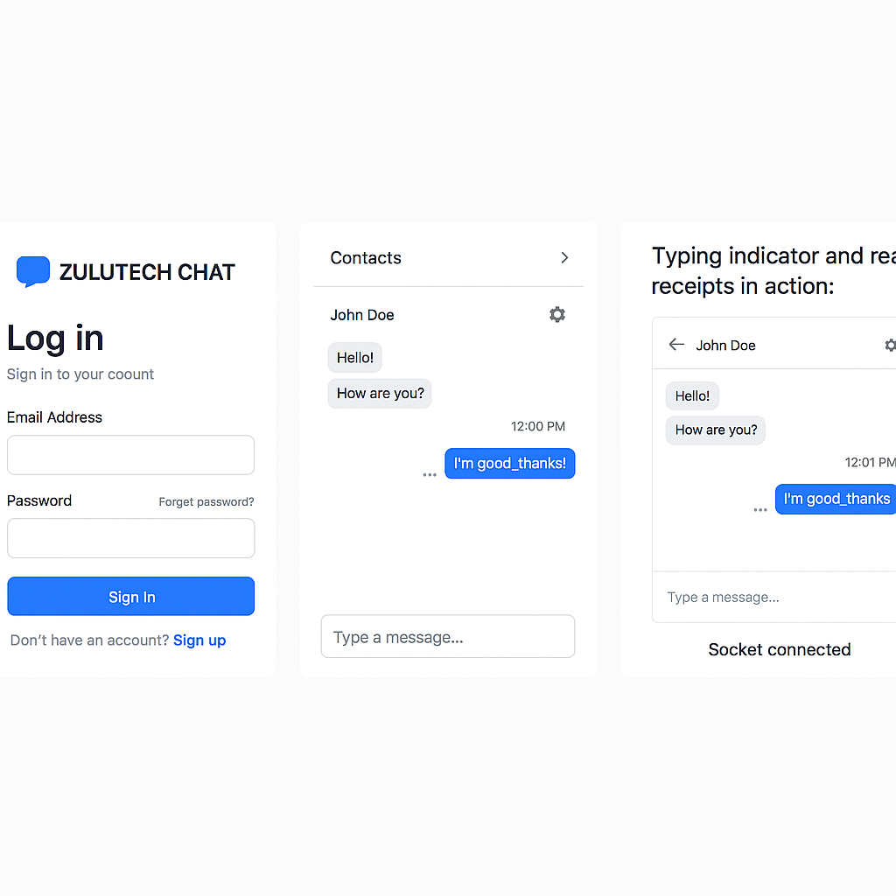

# 💬 Zulutech Real-Time Chat App
## 🏷️ Badges

A full-stack real-time chat platform built with **React**, **Express**, and **Socket.io**, featuring live messaging, user presence, and advanced chat UX.

---

## 🚀 Features

- 🔄 Real-time messaging with Socket.io
- 🔐 User authentication and presence tracking
- 🧩 Multiple chat rooms or private messaging
- ✍️ Typing indicators
- ✅ Read receipts
- 🔔 Real-time notifications

---

## 🧱 Project Structure

socketio-chat/ ├── client/ │ ├── public/ │ ├── src/ │ │ ├── components/ │ │ ├── context/ │ │ ├── hooks/ │ │ ├── pages/ │ │ ├── socket/ │ │ └── App.jsx │ ├── docs/ │ │ └── README.md ← You are here │ └── package.json ├── server/ │ ├── config/ │ ├── controllers/ │ ├── models/ │ ├── socket/ │ ├── utils/ │ ├── server.js │ └── package.json └── README.md ← Original assignment instructions

---

## 🛠️ Setup Instructions

### Prerequisites

- Node.js v18+
- npm or yarn
- MongoDB (local or Atlas)

---

### Installation

# Clone your GitHub Classroom repo
git clone https://github.com/PLP-MERN-Stack-Development/week-5-web-sockets-assignment-leonardphokane.git
cd socketio-chat

# Install server dependencies
cd server
npm install

# Install client dependencies
cd ../client
npm install
Running the App
bash
# Start the server
cd server
npm run dev

# Start the client
cd ../client
npm run dev

---

🌍 Deployment (Optional)
Live App: zulutech-chat.vercel.app API: api.zulutech-chat.onrender.com

📚 Resources
Socket.io Docs

React Docs

Express Docs

GitHub Classroom Repo

---

✅ Submission Checklist
[x] Core chat functionality

[x] 3+ advanced features

[x] Screenshots or GIFs

[x] README.md completed (nested in client/docs)

[x] Pushed to GitHub Classroom repo

---

## 📸 Screenshots

| Login & Signup | Chat Interface |
|----------------|----------------|
|  |  |

> Typing indicator and read receipts in action:
> 

📸 Screenshots / visuals of:
 

Login flow

Chat interface

Typing indicator

Read receipts

Notifications

---

## 🖼️ Zulutech Chat Screenshots

### Landing Page

### Contact Page

### Real-Time Messaging

### Socket Connection Status

---

## 🌍 Deployment Links

- **Live App**: [zulutech-chat.vercel.app](https://zulutech-chat.vercel.app)
- **API Endpoint**: [api.zulutech-chat.onrender.com](https://api.zulutech-chat.onrender.com)

---

## 🏷 Community Tags

`#PowerLearnProject` `#PLPCommunity` `#1MillionDevs4Africa`

---

### 👨🏾‍💻 Author
Leonard Phokane Tech Founder @ Zulutech Building Afrocentric, scalable tech for community empowerment.

---

<section id="contact">
  <h2>Contact</h2>
   <!-- 👤 Profile Image -->
  
  
<strong>Author:</strong> Leonard Phokane

  
<strong>Email:</strong> leonardphokane1@gmail.com

  
<strong>Phone:</strong> +27 72 350 7514

  <!-- 🌐 Personal Website Link -->
  
<strong>Personal Website:</strong> 
    <a href="https://phokane-creative-code.lovable.app/" target="_blank">
      phokane-creative-code.lovable.app
    </a>
  

</section>

---
👉 See [Leonard's Zulutech Chat Implementation](client/docs/README.md)
This keeps everything clean and GitHub Classroom-compliant.
